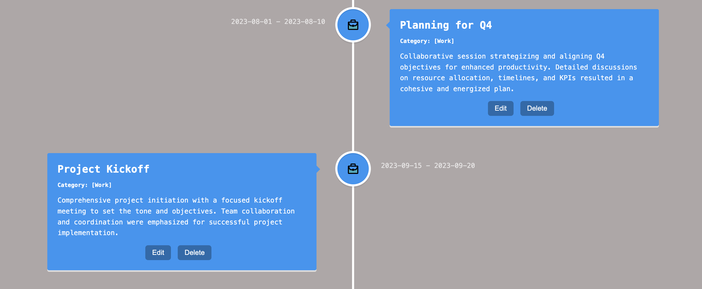

# Exercise

Create a JavaScript frontend app that serves as a simple system for saving events in a timeline. An example could be the history of a company.

## Presentation
- [YouTube Presentation Video](https://youtu.be/05l-8iHh2BE)

## Technologies:
- JavaScript
  - React v18
- Node v20
- HTML5
- CSS3

## Business Requirements
- Events have:
  - Name
  - End date and Start date
  - Long description
  - Category
- Categories have:
  - Name
  - Icon
- Allowed operations on events:
  - Create
  - Edit
  - Remove
- Sort events by dates and categories 
- Group events by categories

## Functional Requirements
- Use JavaScript with the React library

